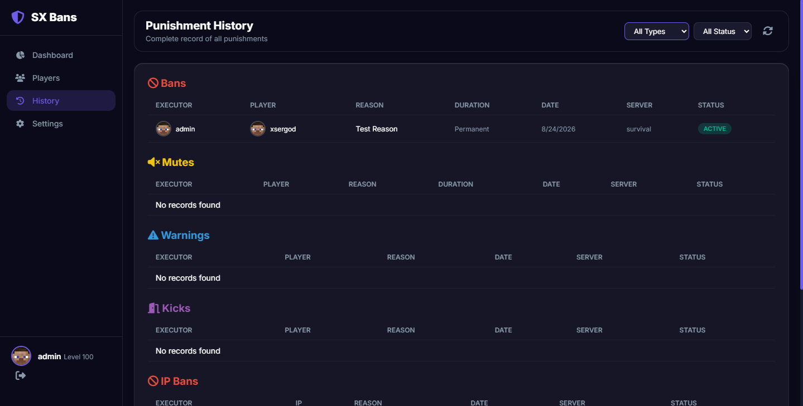
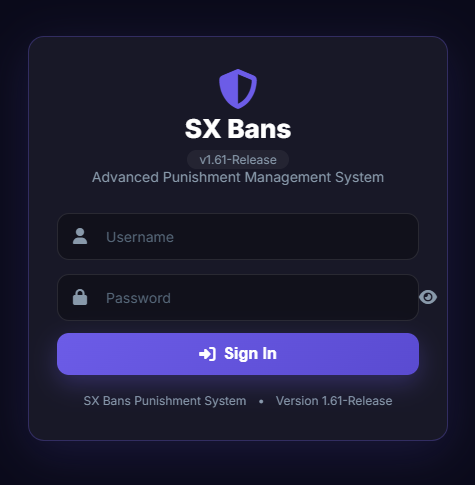
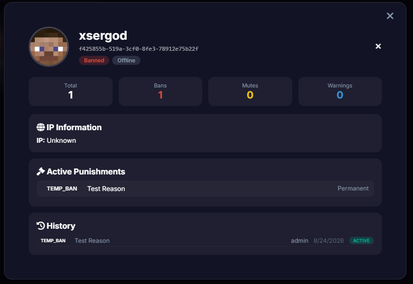
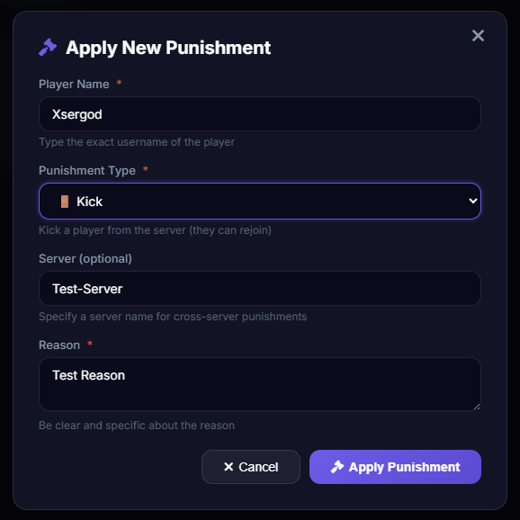

<div align="center">


# SXBans

**A punishment system for Minecraft servers that doesn't make you tab out to a spreadsheet.**

[](#)
[](#)
[](#)
[](#license)
[](https://discord.gg/7xFkMg6apF)

[Features](#features) • [Installation](#installation) • [Commands](#commands) • [Configuration](#configuration) • [Web Panel](#web-panel) • [Wiki](././wiki/Home.md) • [Discord](https://discord.gg/7xFkMg6apF)

</div>

---

## What is this?

SXBans is a punishment/moderation plugin for Spigot/Paper servers. Bans, mutes, kicks, warnings, IP punishments, a full history log, alt-account detection, a web dashboard you can actually use from your phone, and a network layer if you're running more than one server behind BungeeCord or Velocity.

I built this because I was tired of juggling three different plugins to get the feature set I actually wanted — one for bans, one for a web panel, one for cross-server sync — and none of them talked to each other properly. SXBans is my attempt at putting all of that under one roof without it turning into a bloated mess.

It's not trying to reinvent moderation. It's trying to be the plugin you install once and stop thinking about.

## Features

**Core punishments**
- Ban, temp-ban, kick, mute, temp-mute, warn
- IP bans and IP mutes (with automatic alt detection)
- Offline punishing — you don't need the player online to ban them
- Full punishment history per player, with pagination
- Configurable warning thresholds with auto-ban on repeat offenders

**Storage**
- JSON (zero setup, works out of the box)
- SQLite, MySQL, PostgreSQL, H2
- Automatic table/schema creation, connection pooling via HikariCP

**Network / multi-server**
- Redis-backed punishment sync across your whole network
- Works with BungeeCord, Waterfall, *and* Velocity (the sync layer doesn't care which proxy you use — see [Network Setup](./wiki/Network-Setup.md))
- Per-server identity so your logs and web panel actually tell you *which* server issued a punishment
- A documented protocol if you want to write your own proxy-side plugin — see [`NETWORK_PROTOCOL.md`](./NETWORK_PROTOCOL.md)

**Web panel**
- Built-in web server (Jetty), no external dependencies to stand up
- Dashboard, player search, punishment history, live console, settings — all from a browser
- Multi-user accounts with permission levels, not just one shared admin login
- Mobile-friendly enough that you can moderate from your phone during dinner

**Extras**
- Broadcast messages with hover tooltips (fully configurable per punishment type)
- PlaceholderAPI, Vault, and LuckPerms hooks
- Punishment templates for common offenses
- Alt-account detection based on IP history
- Every message in the plugin is configurable, including support for hex colors and Unicode

## Requirements

- A Spigot or Paper server running Minecraft **1.13 through 26.2**
- Java 17 or newer
- That's it for a basic setup. MySQL/PostgreSQL/Redis are optional and only needed if you want them.

## Installation

1. Drop `SXBans.jar` into your `plugins/` folder.
2. Start (or restart) your server. The plugin will generate its config files on first run.
3. Stop the server, take a look at `plugins/SXBans/config.yml` if you want to change the database type, web panel port, or anything else — the defaults work fine for a single small-to-medium server.
4. Start the server again.
5. Check your console — on first launch, SXBans generates a random admin password for the web panel and prints it once. Grab it before it scrolls past. See [Web Panel](#web-panel) below.

That's the whole process. No database setup required unless you want one.

## Commands

| Command | Description | Permission |
|---|---|---|
| `/ban <player> <reason>` | Permanently ban a player | `sxbans.ban` |
| `/tempban <player> <time> <reason>` | Ban a player for a set duration | `sxbans.ban` |
| `/unban <player>` | Remove a ban | `sxbans.unban` |
| `/kick <player> <reason>` | Kick a player | `sxbans.kick` |
| `/mute <player> <reason>` | Mute a player | `sxbans.mute` |
| `/tempmute <player> <time> <reason>` | Mute a player for a set duration | `sxbans.mute` |
| `/unmute <player>` | Remove a mute | `sxbans.unmute` |
| `/warn <player> <reason>` | Issue a warning | `sxbans.warn` |
| `/history <player> [page]` | View a player's punishment history | `sxbans.history` |
| `/check <player>` | Check a player's current status (aliases: `/info`, `/status`) | `sxbans.check` |
| `/ipban <player\|IP> <reason>` | Ban an IP address | `sxbans.ipban` |
| `/ipunban <IP>` | Remove an IP ban | `sxbans.ipunban` |
| `/ipmute <player\|IP> <reason>` | Mute an IP address | `sxbans.ipmute` |
| `/ipunmute <IP>` | Remove an IP mute | `sxbans.ipunmute` |
| `/sxbans reload\|stats\|web\|backup\|clear` | Plugin administration | `sxbans.admin` |

Time format for temp punishments: `1s`, `10m`, `2h`, `7d`, `2w`, `1M`, `1y` — you can chain them too, e.g. `1d12h`.

Full permission list, including bypass nodes and admin levels, is in the [Permissions](./wiki/Permissions.md) wiki page.

## Configuration

The config is split into a few files under `plugins/SXBans/`:

- **`config.yml`** — database type, web panel settings, network/Redis options, warning thresholds, general behavior
- **`messages.yml`** — literally every message the plugin sends, including broadcast text and hover tooltips
- **`templates.yml`** — reusable punishment reasons/templates
- **`data/`** — where JSON storage lives, if you're using it

A couple of settings worth knowing about right away:

```yaml
database:
  type: json   # json | sqlite | mysql | postgresql | h2

network:
  server-name: 'survival'   # shows up in logs, the web panel, and cross-server sync
  sync-punishments: true    # only matters if redis.enabled is true

web:
  enabled: true
  port: 8080
```

If you're only running one server, you can ignore the `network` section entirely. If you're running a network, set `server-name` to something that actually identifies the server (`survival`, `skyblock`, `lobby-1`, whatever makes sense to you) and turn on Redis if you want bans to follow players across servers.

Everything else is documented inline in the config files themselves — I tried to keep the comments useful instead of restating the obvious.

Deeper dive: [Configuration Reference](./wiki/Configuration.md)

## Screenshots

<!--
  Drop your images into the /screenshots folder (see screenshots/README.md for
  suggested file names) and these will render automatically on GitHub. Feel
  free to swap out or remove any of the rows below.
-->

| Dashboard                                      | Players                                             |
|------------------------------------------------|-----------------------------------------------------|
|  |  |

| History                                             | Login                                           |
|-----------------------------------------------------|-------------------------------------------------|
|  |  |


| Player Info Card                                        | Applay Punishment Card                                             |
|---------------------------------------------------------|-----------------------------------------------------|
|  |  |

## Web Panel

Once the server's up, the panel is at `http://your-server-ip:8080` (or whatever port you set). Log in with the `admin` account and the password that got printed to console on first startup — **change it immediately** from Settings once you're in.

From there you get:
- A dashboard with active punishment counts and quick stats
- Full player search with punishment history
- A live server console (admin-only, obviously)
- User management if you want to give staff their own accounts with limited permissions

Details on setting up additional accounts and permission levels: [Web Panel Guide](./wiki/Web-Panel.md)

## Multi-server networks

SXBans can sync punishments across every server in your network through Redis. It doesn't matter whether your proxy is BungeeCord, Waterfall, or Velocity — the sync layer talks over Redis pub/sub, not proxy-specific plugin messaging, so it works the same way regardless.

If you want to build your own proxy-side plugin (say, to block a banned player at the proxy level before they even pick a server), the full message format is documented in [`NETWORK_PROTOCOL.md`](./NETWORK_PROTOCOL.md).

Setup walkthrough: [Network Setup](./wiki/Network-Setup.md)

## Building from source

```bash
git clone https://github.com/mahdixser/SXBans.git
cd SXBans
mvn clean package
```

The built jar will be in `target/`. Requires Maven and JDK 17+.

## Support / Issues

Found a bug or something behaving weird? Open an issue with your server version, the plugin version, and your console log around the time it happened — "it doesn't work" without logs is basically impossible to chase down.

Or just come find us on Discord: **[discord.gg/7xFkMg6apF](https://discord.gg/7xFkMg6apF)**

## License

Apache License 2.0. See [`LICENSE`](./LICENSE) for the full text — short version, you're free to use, modify, and redistribute this, including commercially, as long as you keep the license/copyright notice attached.

## Credits

Built by **XserGod** and the **SX Team**. Thanks to everyone running this on their server and reporting back what broke.

---

<div align="center">
<sub>SXBans 2026</sub>
</div>
